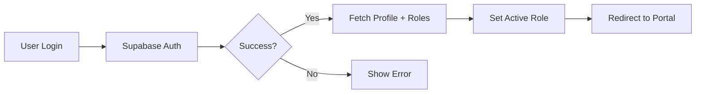

# Synced Momentum - Technical Stack Documentation

> Comprehensive technical reference for the Synced Momentum fitness coaching platform web application.

**Last Updated:** January 2026
**Related Project:** [Synced Momentum iOS App](https://github.com/lawsonsenterprises/fitness-app-ios)

---

## Table of Contents
1. [Project Overview](#project-overview)
2. [Tech Stack](#tech-stack)
3. [Architecture & Design Patterns](#architecture--design-patterns)
4. [Authentication & Authorization](#authentication--authorization)
5. [Database Schema](#database-schema)
6. [API Design](#api-design)
7. [External Integrations](#external-integrations)
8. [Development Setup](#development-setup)
9. [Deployment](#deployment)
10. [File Structure](#file-structure)
11. [Key Libraries & Usage](#key-libraries--usage)
12. [Implementation Status](#implementation-status)

---

## Project Overview

Synced Momentum is a multi-tenant fitness coaching platform with three distinct portals:

- **Athlete Portal** (`/athlete/*`) - Client-facing dashboard for tracking health, nutrition, training, and communicating with coaches
- **Coach Portal** (`/dashboard/*`) - Coach interface for managing clients, reviewing check-ins, assigning programmes/meal plans
- **Admin Portal** (`/admin/*`) - Platform administration for managing coaches, athletes, subscriptions, and analytics

The platform integrates with the iOS app for real-time HealthKit data sync (sleep, recovery, workouts, strain metrics).

---

## Tech Stack

### Frontend Framework
- **Next.js 15.1.0** - React framework with App Router
- **React 18.2** - UI library
- **TypeScript 5.4** - Type-safe JavaScript

### Styling & UI
- **Tailwind CSS 3.4** - Utility-first CSS framework
- **tailwindcss-animate** - Animation utilities
- **shadcn/ui** - Accessible component library built on Radix UI
- **Framer Motion 12.23** - Animation library for micro-interactions
- **Lucide React** - Icon library

### State Management & Data Fetching
- **TanStack Query 5.45** - Server state management, caching, and synchronization
- **Zustand 4.5** - Client state management (minimal usage)
- **React Hook Form 7.69** - Form state and validation
- **Zod 3.25** - Schema validation

### Backend & Database
- **Supabase** - Backend-as-a-Service
  - PostgreSQL database
  - Authentication (email/password, Apple Sign-In via iOS)
  - Row Level Security (RLS) policies
  - Real-time subscriptions (planned for messaging)
- **@supabase/supabase-js 2.45** - Supabase JavaScript client
- **@supabase/ssr 0.5** - Server-side rendering utilities

### Charts & Visualization
- **Recharts 3.6** - Chart library for health/progress tracking

### PDF Generation
- **jsPDF 3.0.4** - PDF generation for reports and exports

### Additional Libraries
- **date-fns 3.6** - Date manipulation
- **sonner 2.0** - Toast notifications
- **@tanstack/react-table 8.21** - Advanced table functionality

### Development Tools
- **ESLint 9.0** - Code linting
- **Prettier 3.3** - Code formatting
- **TypeScript ESLint 8.0** - TypeScript linting
- **Autoprefixer** - CSS vendor prefixing

### Infrastructure
- **Vercel** - Hosting, deployment, and edge functions
- **GitHub** - Version control
- **OpenWeatherMap API** - Weather data for training recommendations

---

## Architecture & Design Patterns

### App Router Structure
Next.js 15 App Router with route groups for role-based portals:

```
app/
├── (athlete)/athlete/*      # Athlete portal (RLS enforced)
├── (dashboard)/*             # Coach portal (role-gated)
├── (admin)/admin/*           # Admin portal (admin role required)
├── (auth)/*                  # Authentication pages (login, register, etc.)
└── api/*                     # API routes (minimal - prefer server actions)
```

### Design Patterns

**1. Server Actions over API Routes**
- Primary pattern: Server Actions in `app/actions/` for mutations
- API routes only for webhooks, health checks, or third-party integrations

**2. Data Fetching with TanStack Query**
- Custom hooks in `hooks/` abstract Supabase queries
- Query keys follow convention: `['resource', id, ...params]`
- Optimistic updates for better UX
- Automatic cache invalidation

**3. Row Level Security (RLS)**
- Database-level access control
- Policies enforce: "Users can only see their own data"
- Coach access via `coach_clients` join table (when implemented)

**4. Role-Based Access Control (RBAC)**
- Roles stored in `profiles.roles[]` array
- Middleware enforces route access based on roles
- Client-side role switching for multi-role users
- Active role stored in localStorage

**5. Type Safety**
- `lib/database.types.ts` - Auto-generated from Supabase schema
- Zod schemas in `lib/validations.ts` for form validation
- Strict TypeScript configuration

---

## Authentication & Authorization

### Authentication Flow

**Providers:**
- Email/Password (web + iOS)
- Apple Sign-In (iOS only)

**Session Management:**
- Supabase Auth with JWT tokens
- Cookie-based sessions (handled by `@supabase/ssr`)
- Middleware refreshes sessions on each request

**Auth Flow:**


### Authorization Layers

**1. Middleware (`middleware.ts`)**
- Protects routes based on authentication state
- Enforces role-based access:
  - `/athlete/*` requires `athlete` role
  - `/dashboard/*` requires `coach` role
  - `/admin/*` requires `admin` or `super_admin` role
- Redirects unauthorized users to appropriate portal
- Handles forced password change flow

**2. Row Level Security (Database)**
- `user_id` column links data to authenticated user
- RLS policies: `auth.uid() = user_id`
- Coach access via join policies (when coach_clients table exists)

**3. Client-Side Guards**
- `useAuth()` hook provides user state
- Protected components check `roles` array
- UI conditionally renders based on permissions

### Roles

| Role | Access | Description |
|------|--------|-------------|
| `athlete` | `/athlete/*` | Standard user, tracks health/training |
| `coach` | `/dashboard/*` | Manages clients, assigns programmes |
| `admin` | `/admin/*` | Manages coaches and athletes |
| `super_admin` | `/admin/*` + elevated | Full platform access + user management |

### Password Management

**Features:**
- Password reset via email
- Forced password change (admin can trigger via `user_metadata.force_password_change`)
- Password requirements: 8+ chars, 1 uppercase, 1 number, 1 special character
- Utilities in `lib/password-utils.ts`

**Admin Capabilities:**
- Reset any user's password (email/password accounts only, not OAuth)
- Force password change on next login
- Password strength validation

---

## Database Schema

### Production Tables (Applied)

**User Management:**
- `profiles` - User profiles with `id`, `display_name`, `avatar_url`, `roles[]`, `postcode`, `apple_sub`, `onboarding_completed`

**Health Tracking (HealthKit Sync from iOS):**
- `daily_readiness_summaries` - Strain, recovery, readiness scores
- `daily_sleep_summaries` - Sleep duration, quality, stages
- `daily_recovery_summaries` - HRV, RHR, respiratory rate, SpO2, wrist temp
- `daily_workouts` - Workout sessions from Apple Watch

**Check-ins:**
- `check_ins` - Weekly/daily athlete check-ins with weight, sleep, training notes
- `check_in_days` - Individual day entries within a check-in period

**Blood Work:**
- `blood_panels` - Blood test panel metadata
- `blood_markers` - Individual marker definitions
- `blood_tests_v2` - Test results with markers and values

**Nutrition:**
- `meal_plans` - Athlete meal plans
- `meals` - Individual meals
- `food_items` - Food items in meals
- `food_database` - Food nutrition database
- `nutrition_food_entries` - Daily food logging
- `user_dietary_profiles` - Macro targets, TDEE calculations

**Training:**
- `programmes` - Training programmes
- `programme_days` - Days within programmes
- `workout_items` - Exercises in workouts
- `exercises` - Exercise library
- `training_days` - Training session logs
- `training_sessions` - Session metadata

**Supplements:**
- `supplements` - Supplement definitions
- `supplement_intakes` - Daily supplement compliance tracking

**Other:**
- `weight_logs` - Historical weight tracking
- `sleep_records` - Manual sleep logs
- `water_logs` - Daily water intake

### Pending Migrations (Not Applied to Production)

**Coach Portal Infrastructure:**
- `coach_clients` - Coach-athlete relationships
- `programme_templates` - Reusable programme templates
- `programme_assignments` - Assign templates to clients
- `meal_plan_templates` - Reusable meal plan templates
- `meal_plan_assignments` - Assign meal plans to clients
- `coach_messages` - Coach-client messaging
- `coach_notes` - Private coach notes on clients
- `notification_preferences` - User notification settings

**Admin Portal Infrastructure:**
- `platform_metrics` - Platform-wide analytics
- `subscriptions` - Stripe subscription management
- `support_tickets` - Support ticket system

**See:** `supabase/migrations/` for full migration files.

### RLS Policies

**Current:**
- HealthKit tables: Users can only access their own data (`auth.uid() = user_id`)
- Most tables follow same pattern

**Planned:**
- Coach access policies via `coach_clients` join
- Admin bypass policies for platform management

---

## API Design

### Server Actions (`app/actions/`)

**Philosophy:** Prefer Server Actions over API routes for mutations.

**Current Actions:**
- `change-password.ts` - User password change
- `reset-user-password.ts` - Admin password reset
- `promote-admin.ts` / `demote-admin.ts` - Admin role management
- `promote-to-super-admin.ts` - Super admin promotion
- `invite-admin.ts` - Send admin invitations
- `apply-pending-invite.ts` - Accept admin invite
- `get-pending-invites.ts` - Fetch pending invitations
- `resend-invite.ts` - Resend admin invitation email
- `delete-admin.ts` - Remove admin user

**Pattern:**
```typescript
'use server'

import { createClient } from '@/lib/supabase/server'

export async function actionName(params: Params) {
  const supabase = await createClient()

  // Verify authentication
  const { data: { user }, error } = await supabase.auth.getUser()
  if (!user) throw new Error('Unauthorized')

  // Verify permissions (if needed)
  // ... role checks

  // Perform action
  const result = await supabase.from('table').insert(...)

  // Revalidate cache if needed
  revalidatePath('/path')

  return result
}
```

### API Routes (`app/api/`)

**Current Routes:**
- `auth/callback/route.ts` - OAuth callback handler
- `health/route.ts` - Health check endpoint

**Pattern:**
```typescript
import { NextRequest, NextResponse } from 'next/server'

export async function GET(request: NextRequest) {
  // Handle request
  return NextResponse.json({ data })
}
```

### Data Fetching Hooks (`hooks/`)

**Convention:**
- File: `use-<resource>.ts`
- Export: Named exports for queries and mutations
- Built on: TanStack Query

**Example Pattern:**
```typescript
import { useQuery, useMutation, useQueryClient } from '@tanstack/react-query'
import { createClient } from '@/lib/supabase/client'

export function useResource(id: string) {
  const supabase = createClient()

  return useQuery({
    queryKey: ['resource', id],
    queryFn: async () => {
      const { data, error } = await supabase
        .from('table')
        .select('*')
        .eq('id', id)
        .single()

      if (error) throw error
      return data
    },
  })
}

export function useUpdateResource() {
  const queryClient = useQueryClient()

  return useMutation({
    mutationFn: async (params: UpdateParams) => {
      const supabase = createClient()
      const { data, error } = await supabase
        .from('table')
        .update(params)
        .eq('id', params.id)

      if (error) throw error
      return data
    },
    onSuccess: () => {
      queryClient.invalidateQueries({ queryKey: ['resource'] })
    },
  })
}
```

**Athlete Hooks (`hooks/athlete/`):**
- `use-athlete-dashboard.ts` - Dashboard data aggregation
- `use-healthkit.ts` - HealthKit data from iOS (readiness, sleep, recovery, workouts)
- All hooks return properly typed data with loading/error states

**Coach Hooks:**
- `use-clients.ts` - Client management (currently empty, pending `coach_clients` table)
- `use-programmes.ts` - Programme templates (currently empty)
- `use-meal-plans.ts` - Meal plan templates (currently empty)
- `use-check-ins.ts` - Check-in review workflow (partially implemented)
- `use-messages.ts` - Messaging (currently empty)

**Admin Hooks (`hooks/admin/`):**
- Admin user management hooks

---

## External Integrations

### OpenWeatherMap API

**Purpose:** Display local weather on athlete dashboard with training recommendations

**Configuration:**
```bash
NEXT_PUBLIC_OPENWEATHER_API_KEY=your-key-here
```

**Free Tier:** 1,000 API calls/day
**Usage:** Current conditions + 5-day forecast
**Location:** UK postcodes (stored in `profiles.postcode`)

**Implementation:**
- Component: `components/athlete/weather-widget.tsx`
- Geocoding: Converts UK postcode to lat/long
- Caching: Client-side caching to reduce API calls
- Fallback: London coordinates if geolocation denied

**Training Recommendations:**
- Thunderstorm: Stay indoors
- Rain: Indoor training recommended
- Snow: Stay warm, indoor cardio
- Temp < 5°C: Warm-up thoroughly
- Temp > 25°C: Stay hydrated, train early/late
- Clear/Partly cloudy: Great for outdoor training

### Blood Work PDF Parser

**Purpose:** Parse blood test PDFs to extract marker values

**Implementation:**
- Upload endpoint: `app/(athlete)/athlete/blood-work/upload/page.tsx`
- External service: PDF parsing (details TBD - may be external API or local library)
- Data mapping: Maps extracted values to `blood_markers` definitions
- Storage: Results stored in `blood_tests_v2` table

### Apple Sign-In (iOS App)

**Purpose:** Seamless authentication for iOS users

**Flow:**
1. User signs in with Apple on iOS app
2. iOS app stores Apple ID token and creates Supabase session
3. Web app shares Supabase session via cookies
4. `profiles.apple_sub` stores Apple user identifier

**Implementation:**
- Handled primarily by iOS app
- Web app recognizes Apple Sign-In users via `identities` check
- Password management disabled for OAuth users

---

## Development Setup

### Prerequisites
- Node.js 20+
- npm or pnpm
- Supabase account
- OpenWeatherMap API key (optional, for weather widget)

### Environment Variables

Create `.env.local`:

```bash
# Supabase
NEXT_PUBLIC_SUPABASE_URL=https://your-project.supabase.co
NEXT_PUBLIC_SUPABASE_ANON_KEY=your-anon-key
SUPABASE_SERVICE_ROLE_KEY=your-service-role-key

# App
NEXT_PUBLIC_APP_URL=http://localhost:3000
NEXT_PUBLIC_APP_NAME="Synced Momentum"

# Weather (Optional)
NEXT_PUBLIC_OPENWEATHER_API_KEY=your-api-key
```

### Installation

```bash
# Install dependencies
npm install

# Run development server
npm run dev

# Type checking
npm run type-check

# Lint
npm run lint

# Format code
npm run format
```

### Database Setup

**Local Development:**
```bash
# Initialize Supabase locally
npx supabase init

# Link to project
npx supabase link --project-ref your-project-ref

# Pull remote schema
npx supabase db pull

# Apply migrations
npx supabase db push
```

**Supabase Dashboard:**
1. Create project on supabase.com
2. Copy project URL and anon key to `.env.local`
3. Run migrations in SQL editor (if not using Supabase CLI)

### Type Generation

Generate TypeScript types from Supabase schema:

```bash
npx supabase gen types typescript --project-id your-project-ref > lib/database.types.ts
```

---

## Deployment

### Vercel Configuration

**Build Command:**
```bash
npm run build
```

**Environment Variables:**
Set in Vercel dashboard:
- `NEXT_PUBLIC_SUPABASE_URL`
- `NEXT_PUBLIC_SUPABASE_ANON_KEY`
- `SUPABASE_SERVICE_ROLE_KEY`
- `NEXT_PUBLIC_APP_URL`
- `NEXT_PUBLIC_APP_NAME`
- `NEXT_PUBLIC_OPENWEATHER_API_KEY`

**Framework:** Next.js
**Node Version:** 20.x
**Output Directory:** `.next`

### CI/CD

**GitHub Actions:**
- Automatic deployment on push to `main` branch
- Preview deployments on pull requests
- Type checking and linting in CI

**Branch Strategy:**
- `main` - Production
- Feature branches - Preview deployments

---

## File Structure

```
fitness-app-web/
├── app/                          # Next.js App Router
│   ├── (admin)/admin/*           # Admin portal
│   ├── (athlete)/athlete/*       # Athlete portal
│   ├── (dashboard)/*             # Coach portal
│   ├── (auth)/*                  # Auth pages
│   ├── actions/                  # Server Actions
│   ├── api/                      # API routes
│   ├── layout.tsx                # Root layout
│   └── providers.tsx             # Client providers
│
├── components/                   # React components
│   ├── admin/                    # Admin components
│   ├── athlete/                  # Athlete components
│   │   ├── dashboard/            # Dashboard widgets
│   │   ├── nutrition/            # Nutrition tracking
│   │   ├── training/             # Training components
│   │   ├── progress/             # Progress tracking
│   │   └── weather-widget.tsx   # Weather integration
│   ├── dashboard/                # Coach components
│   ├── shared/                   # Shared components
│   │   └── charts/               # Chart components
│   └── ui/                       # shadcn/ui components
│
├── contexts/                     # React contexts
│   └── auth-context.tsx          # Authentication state
│
├── hooks/                        # Custom hooks
│   ├── admin/                    # Admin hooks
│   ├── athlete/                  # Athlete hooks
│   │   ├── use-athlete-dashboard.ts
│   │   └── use-healthkit.ts
│   ├── coach/                    # Coach hooks
│   ├── use-auth.ts               # Auth hook
│   ├── use-clients.ts            # Client management
│   ├── use-programmes.ts         # Programme templates
│   └── use-meal-plans.ts         # Meal plan templates
│
├── lib/                          # Utilities
│   ├── supabase/                 # Supabase clients
│   │   ├── client.ts             # Browser client
│   │   └── server.ts             # Server client
│   ├── database.types.ts         # Generated types
│   ├── constants.ts              # App constants
│   ├── roles.ts                  # Role definitions
│   ├── validations.ts            # Zod schemas
│   ├── password-utils.ts         # Password utilities
│   ├── blood-markers.ts          # Blood marker definitions
│   └── utils.ts                  # General utilities
│
├── supabase/                     # Supabase config
│   └── migrations/               # Database migrations
│
├── public/                       # Static assets
├── middleware.ts                 # Next.js middleware
├── next.config.ts                # Next.js config
├── tailwind.config.ts            # Tailwind config
├── tsconfig.json                 # TypeScript config
├── .env.example                  # Example env vars
├── TECH_STACK.md                 # This file
├── PORTAL_STATUS.md              # Implementation status
├── OUTSTANDING_ITEMS.md          # To-do list
└── README.md                     # Project overview
```

---

## Key Libraries & Usage

### TanStack Query
**Purpose:** Server state management
**Usage:**
- `useQuery` for data fetching
- `useMutation` for updates
- Query keys: `['resource', id, filters]`
- Automatic caching and revalidation
- Optimistic updates for better UX

**Example:**
```typescript
const { data, isLoading, error } = useQuery({
  queryKey: ['check-ins', userId],
  queryFn: async () => fetchCheckIns(userId),
})
```

### Framer Motion
**Purpose:** Animations and micro-interactions
**Usage:**
- `motion` components for declarative animations
- Stagger effects on lists
- Page transitions
- Gesture-based interactions

**Example:**
```typescript
<motion.div
  initial={{ opacity: 0, y: 20 }}
  animate={{ opacity: 1, y: 0 }}
  transition={{ delay: 0.1 }}
>
  Content
</motion.div>
```

### React Hook Form + Zod
**Purpose:** Form management with type-safe validation
**Usage:**
- Define Zod schema in `lib/validations.ts`
- Use `useForm` with `zodResolver`
- Automatic error handling

**Example:**
```typescript
import { useForm } from 'react-hook-form'
import { zodResolver } from '@hookform/resolvers/zod'
import { loginSchema } from '@/lib/validations'

const form = useForm({
  resolver: zodResolver(loginSchema),
  defaultValues: { email: '', password: '' },
})
```

### shadcn/ui
**Purpose:** Accessible, customizable components
**Components Used:**
- Button, Input, Label
- Dialog, Sheet (modals)
- Dropdown Menu, Select
- Toast (via Sonner)
- Table

**Installation:**
```bash
npx shadcn-ui@latest add button
```

### Recharts
**Purpose:** Data visualization
**Charts Used:**
- LineChart - Weight trends, blood markers
- AreaChart - Progress over time
- BarChart - Training volume
- PieChart - Macro breakdown

---

## Implementation Status

### ✅ Fully Implemented (Athlete Portal)

**Dashboard:**
- HealthKit integration (readiness, sleep, recovery, workouts from iOS)
- Daily macro tracking from nutrition logs
- Weight trend widget
- Weather widget with training recommendations
- Recent check-ins display

**Blood Work:**
- Upload PDFs
- View panel details with markers
- Trend charts for individual markers
- Optimal range indicators
- Filter by category

**Nutrition:**
- Daily food logging
- Macro tracking against targets
- Meal plan viewing (assigned by coach)
- TDEE calculations

**Recovery:**
- HealthKit recovery metrics (HRV, RHR, respiratory rate, SpO2, wrist temp)
- Readiness score breakdown (Strain, Recovery, Sleep)
- Historical trends

**Training:**
- View assigned programmes
- Exercise library
- Log training sessions

**Settings:**
- Profile management
- Password change (email/password accounts only)
- Notification preferences
- Goals setup

### ⚠️ Partially Implemented (Coach Portal)

**Status:** UI exists, backend infrastructure missing

**Blockers:**
- No `coach_clients` table (coach-athlete relationships)
- No `programme_templates` or `meal_plan_templates` tables
- No coach review fields in `check_ins` table
- No `coach_messages` table

**Pages Built (Mock Data):**
- Dashboard with analytics
- Client list and detail pages
- Check-in review queue
- Programme template editor
- Meal plan template editor
- Messaging interface

**Required Migrations:**
See `supabase/migrations/20251227*` and `20251228*` files

### ❌ Not Implemented (Admin Portal)

**Status:** UI exists, 100% mock data

**Blockers:**
- No platform analytics tables
- No subscription/billing integration (Stripe)
- No support ticket system
- No admin role validation on many routes

**Pages Built (Mock Data):**
- Dashboard with platform metrics
- Coach management
- Athlete management
- Subscription management
- Analytics dashboards
- Support ticket system

**Required Work:**
1. Apply admin infrastructure migrations
2. Integrate Stripe for subscriptions
3. Build real-time analytics aggregation
4. Implement support ticket workflow

---

## Roadmap & Priority

### Phase 1: Coach Portal Foundation (High Priority)
1. Apply `coach_clients` and role migrations
2. Implement RLS policies for coach access
3. Update client management hooks with real queries
4. Enable check-in review workflow

### Phase 2: Programme & Meal Plan Templates
1. Apply template migrations
2. Build template editor UI (backend integration)
3. Enable template assignment to clients
4. Client view of assigned templates

### Phase 3: Messaging System
1. Apply `coach_messages` migration
2. Implement real-time messaging with Supabase Realtime
3. Push notifications for new messages
4. Message history and search

### Phase 4: Admin Portal
1. Platform analytics infrastructure
2. Stripe integration for subscriptions
3. Support ticket system
4. Admin user management tools

### Phase 5: Advanced Features
- Progress photos upload and comparison
- Body measurements tracking
- Advanced analytics dashboards
- Custom report generation
- Mobile app notifications bridge

---

## Additional Documentation

- **PORTAL_STATUS.md** - Detailed implementation status per portal
- **OUTSTANDING_ITEMS.md** - Current to-do list
- **PLAN.md** - Feature planning documents
- **CLAUDE.md** - Claude AI specific instructions

---

**Maintained by:** Synced Momentum Development Team
**Questions?** See documentation files or contact the team.
